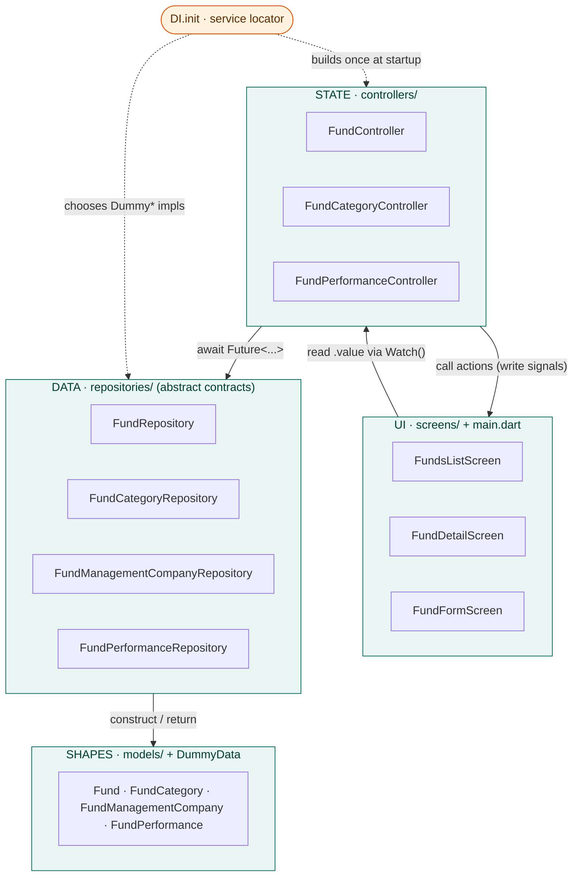
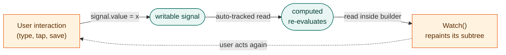
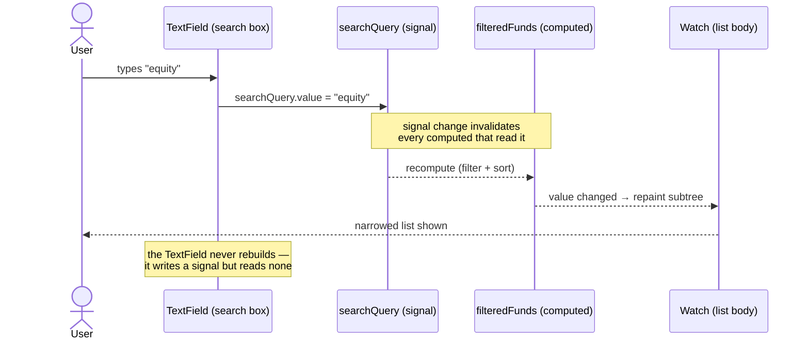

# MoneyTrack — Code Walkthrough

A step-by-step tour of the entire app, built **from the ground up**: we start
at the data layer (models and repositories), climb through the wiring
(dependency injection), into the state layer (controllers), and finish at the
UI (screens). By the end you should be able to trace any pixel on screen back
to the row of data that produced it.

> **How to read this document.** Each section explains *what* a file does,
> *why* it's shaped that way, and *how* it connects to the layer above it.
> Code snippets are quoted from the real files with their line numbers so you
> can open the source alongside.

---

## Table of contents

1. [The big picture](#1-the-big-picture)
2. [A 5-minute primer on signals](#2-a-5-minute-primer-on-signals)
3. [Layer 0 — the models](#3-layer-0--the-models)
4. [Layer 1 — the repositories](#4-layer-1--the-repositories)
5. [The seed data (`DummyData`)](#5-the-seed-data-dummydata)
6. [The wiring — dependency injection](#6-the-wiring--dependency-injection)
7. [Layer 2 — the controllers](#7-layer-2--the-controllers)
8. [Bootstrapping — `main.dart`](#8-bootstrapping--maindart)
9. [Layer 3 — the screens](#9-layer-3--the-screens)
10. [Putting it together — three end-to-end journeys](#10-putting-it-together--three-end-to-end-journeys)
11. [The test, and why it's tiny](#11-the-test-and-why-its-tiny)
12. [Iteration 2 — the Supabase swap](#12-iteration-2--the-supabase-swap)

---

## 1. The big picture

MoneyTrack is a fund-performance browser. It shows a searchable, filterable
list of investment funds; tapping one opens a detail screen with a 12-month
return chart, statistics, and history; a form lets you add or edit funds.

The whole app is built around **one architectural rule**: dependencies point
in a single direction, and each layer only knows about the *abstraction*
directly beneath it.

```
┌──────────────────────────────────────────────────────────────┐
│  SCREENS          funds_list · fund_detail · fund_form         │  UI
│  read state through Watch(), write to signals on interaction   │
└───────────────┬────────────────────────────────────────────────┘
                │ reads .value / calls actions
┌───────────────▼────────────────────────────────────────────────┐
│  CONTROLLERS      FundController · FundCategoryController ·      │  STATE
│                   FundPerformanceController                      │
│  own signals + computed derived state; call repositories        │
└───────────────┬────────────────────────────────────────────────┘
                │ awaits Future<...>
┌───────────────▼────────────────────────────────────────────────┐
│  REPOSITORIES     abstract contracts + Dummy* implementations   │  DATA
│  return models, simulate latency                                │
└───────────────┬────────────────────────────────────────────────┘
                │ constructs
┌───────────────▼────────────────────────────────────────────────┐
│  MODELS + DummyData    Fund · FundCategory · … + seed lists     │  SHAPES
└──────────────────────────────────────────────────────────────────┘

        DI (dependency_injection.dart) wires all of this together once,
        at startup, from main().
```

**Why this matters.** Because the screens and controllers only ever touch
*abstract* repository types, the entire data source can be replaced — dummy
in-memory lists today, a live Supabase backend tomorrow — by changing **four
lines** in one file. We'll see exactly how at the end.

The dependency list is deliberately tiny (`pubspec.yaml`):

```yaml
dependencies:
  signals: ^6.0.2   # reactive state: signal / computed / Watch
  intl: ^0.20.2     # date formatting for the history table
```

No `provider`, no `bloc`, no `riverpod`, no charting library. That's the point
— the app demonstrates that a clean layered design plus signals is enough.

### The same picture, rendered

The diagram below shows the four layers, the write-path (solid, top-down) and
the reactive read-path (dashed, bottom-up), with `DI` wiring the graph once at
startup.



The key visual truth: arrows into `DATA` and `SHAPES` only ever point at the
**abstract** boxes. No screen or controller has an edge to a `Dummy*` class —
that's why `DI` can repoint them at Supabase without anything above noticing.

---

## 2. A 5-minute primer on signals

Every layer above the repositories speaks in terms of **signals**, so it's
worth understanding them before reading any controller or screen. There are
only three concepts.

### `signal(x)` — a reactive value

A `signal` is a box holding a value. You read it with `.value` and write it
with `.value = ...`. The magic: anything that *read* the signal is
automatically remembered as a dependency, and re-runs when the value changes.

```dart
final searchQuery = signal('');      // create
searchQuery.value;                   // read  -> ''
searchQuery.value = 'money market';  // write -> notifies all readers
```

There are typed collection variants used in this codebase:

- `listSignal<T>([])` — a signal wrapping a `List<T>` with helpers like
  `.add(...)` that mutate **and** notify in one call.
- `mapSignal<K,V>({})` — the same idea for a `Map`.

### `computed(() => ...)` — derived state

A `computed` is a value *calculated* from other signals. It re-evaluates only
when a signal it actually read has changed, and caches its result otherwise.
You never set a computed; you only read its `.value`.

```dart
late final filteredFunds = computed(() {
  // reads funds, searchQuery, selectedCategoryId…
  // …so it recomputes whenever any of those three change.
});
```

This is the workhorse of the app: search, filtering, chart data, statistics,
and lookup tables are all `computed` values that maintain themselves.

### `Watch((context) => ...)` — a reactive widget

`Watch` is a Flutter widget whose builder re-runs when any signal it reads
changes. Crucially, it rebuilds **only its own subtree**, not the whole
screen. This replaces `setState`, `StreamBuilder`, and manual listeners.

```dart
Watch((context) {
  final funds = _fundController.filteredFunds.value; // subscribe
  return ListView(...);                              // rebuilds on change
});
```

**Mental model for the entire app:**
> Widgets *write* to signals on user interaction → `computed` values recalculate
> → `Watch` widgets that read them repaint. No glue code in between.



Keep this loop in mind; every screen is an instance of it.

---

## 3. Layer 0 — the models

**Files:** `lib/models/fund.dart`, `fund_category.dart`,
`fund_management_company.dart`, `fund_performance.dart`

Models are plain Dart classes that mirror the Postgres tables **column for
column**. They are the "shapes" that flow up through every layer. Four rules
are followed by all of them:

1. **All fields are `final`** — models are immutable. State can only change by
   building a *new* object, never by mutating an existing one. This is what
   makes signal change-detection reliable (a new object reference = a real
   change).
2. **`fromJson` / `toJson` use the exact Supabase column names** (`fund_id`,
   `management_fee`, …). Because the dummy data and the future Supabase rows
   share these key names, the models deserialize identically from either
   source.
3. **Nullable vs. required mirrors the schema's `NOT NULL` constraints.**
4. **Numeric coercion is explicit** — Postgres `NUMERIC` decodes as `num`, so
   fees/rates are normalised with `(json['x'] as num?)?.toDouble()`.

### 3.1 `Fund` — the central entity

`Fund` is the star of the app: the list shows funds, the detail screen shows
one, the form creates/edits one. Its fields (`fund.dart:4-24`):

```dart
final int fundId;           // primary key
final String fundName;      // NOT NULL
final String? fundCode;     // ticker-style, e.g. "CICMMF"
final int? companyId;       // FK -> fund_management_companies
final int? categoryId;      // FK -> fund_categories
final String? currency;
final double? managementFee; // 2.0 == 2.0% p.a.
final String? description;
final String? investmentObjective;
final bool isActive;        // soft-delete flag
final DateTime createdAt;
final DateTime updatedAt;
```

The two foreign keys (`companyId`, `categoryId`) are the joins that the UI
resolves later into a manager name and a category label.

#### `copyWith` — the immutability workhorse (`fund.dart:77-103`)

```dart
Fund copyWith({ int? fundId, String? fundName, /* … */ DateTime? updatedAt }) =>
    Fund(
      fundId: fundId ?? this.fundId,
      fundName: fundName ?? this.fundName,
      // …
      createdAt: createdAt,                 // never changes
      updatedAt: updatedAt ?? DateTime.now(),
    );
```

Since you can't mutate a `Fund`, `copyWith` is how edits happen: produce a new
`Fund` with a few fields replaced. Note two deliberate details:

- `createdAt` is **not** a parameter — creation time is set once and preserved.
- `updatedAt` defaults to `DateTime.now()`, so every copy is automatically
  timestamped. This mirrors an `updated_at` trigger in a database.

This method is used by the repository (to stamp a new id on create) and by the
controller (to flip `isActive` on delete). Watch for it below.

### 3.2 The supporting models

- **`FundCategory`** (`fund_category.dart`) — id, name, description, and a
  free-text `riskLevel` ("Low", "High", …). Four of these exist (Money Market,
  Fixed Income, Equity, Balanced).
- **`FundManagementCompany`** (`fund_management_company.dart`) — the fund
  manager: name, contact details, and `regulatoryStatus` ("CMA Licensed").
  Shown on the detail screen's manager card.
- **`FundPerformance`** (`fund_performance.dart`) — **one row per fund per
  month**: `performanceDate`, `annualReturnRate` (e.g. `13.42` = 13.42% p.a.),
  and `rankPosition` (1 = best fund that month). Twelve of these per fund power
  the chart, the statistics, and the history table.

One nice detail in `FundPerformance.toJson` (`fund_performance.dart:43`): a
`DATE` column wants `yyyy-MM-dd`, so it truncates the ISO timestamp:

```dart
'performance_date': performanceDate.toIso8601String().substring(0, 10),
```

**Takeaway:** models carry no logic beyond serialization and `copyWith`. They
are dumb data. All behaviour lives above them.

---

## 4. Layer 1 — the repositories

**Files:** `lib/repositories/fund_repository.dart`,
`fund_category_repository.dart`, `fund_management_company_repository.dart`,
`fund_performance_repository.dart`

Each repository is **two things in one file**:

1. An `abstract class` — the *contract* the rest of the app depends on.
2. A `Dummy…` class — the iteration-1 *implementation* backed by in-memory
   lists.

This split is the linchpin of the whole architecture. Controllers import and
hold the abstract type; they have no idea whether the data comes from a list or
a network. Let's read each one.

### 4.1 `FundRepository` — the only read/write repository

Funds are the only entity the user can create and edit, so this contract is the
richest (`fund_repository.dart:6-20`):

```dart
abstract class FundRepository {
  Future<List<Fund>> getFunds();          // read all (active + inactive)
  Future<Fund> createFund(Fund fund);     // insert, returns row w/ new id
  Future<Fund> updateFund(Fund fund);     // update, returns stored version
  Future<void> deactivateFund(int fundId);// SOFT delete (is_active = false)
}
```

Two design decisions are baked into the contract itself:

- **`getFunds()` returns *everything*, active or not.** The repository doesn't
  decide what's visible — the controller's `filteredFunds` does. Keeping the
  filter in the state layer means the same fetched data can be filtered many
  ways without re-hitting the data source.
- **Delete is a soft delete.** Real financial systems rarely hard-delete
  records that have history hanging off them (here, `fund_performance` rows
  cascade from a fund). So `deactivateFund` flips a flag rather than removing a
  row — exactly what the Supabase version will do.

#### The dummy implementation (`fund_repository.dart:25-68`)

```dart
class DummyFundRepository implements FundRepository {
  // A PRIVATE copy of the seed list, so create/update/delete behave like a
  // real backend for the app session without mutating the shared seed data.
  final List<Fund> _funds = List<Fund>.from(DummyData.funds);

  int get _nextId =>
      _funds.map((f) => f.fundId).fold(0, (a, b) => a > b ? a : b) + 1;
```

Line-by-line reasoning:

- **The private working copy** (`_funds`) is critical. If the repository
  mutated `DummyData.funds` directly, every repository instance (and the test)
  would share and corrupt the same list. Copying on construction isolates state.
- **`_nextId`** computes `max(existing ids) + 1`, imitating a Postgres `SERIAL`
  column so newly created funds get realistic sequential ids.

Each method **awaits an artificial delay** before doing its work:

```dart
Future<List<Fund>> getFunds() async {
  await Future<void>.delayed(const Duration(milliseconds: 350));
  return List<Fund>.unmodifiable(_funds);   // callers can't mutate our state
}
```

The 250–350ms delays exist so the app's **loading spinners are actually
visible** — without them the dummy data would return instantly and you'd never
see the async states the UI is built to handle. Returning an *unmodifiable*
view is another defensive touch: callers get the data but can't reach in and
change the repository's internals.

`createFund` shows `copyWith` doing its job (`fund_repository.dart:41-47`):

```dart
final created = fund.copyWith(fundId: _nextId, updatedAt: DateTime.now());
_funds.add(created);
return created;   // caller gets the server-assigned id back
```

`updateFund` finds the row by id and replaces it (throwing `StateError` if the
id is unknown), and `deactivateFund` replaces the row with
`copyWith(isActive: false)`. Notice **nothing is ever mutated in place** — even
here in the "database", every change produces a new immutable `Fund`.

### 4.2 The three read-only repositories

The other three follow the same abstract-plus-dummy shape but only expose
reads.

**`FundCategoryRepository`** (`fund_category_repository.dart`) — returns all
categories sorted by name:

```dart
final list = List<FundCategory>.from(DummyData.categories)
  ..sort((a, b) => a.categoryName.compareTo(b.categoryName));
```

(It copies the list *before* sorting so it never reorders the shared seed.)

**`FundManagementCompanyRepository`** — returns only **active** companies,
sorted by name, using a `.where((c) => c.isActive)` filter.

**`FundPerformanceRepository`** is the most interesting of the three because it
exposes **two differently-shaped reads** for two different screens
(`fund_performance_repository.dart:5-14`):

```dart
abstract class FundPerformanceRepository {
  // Full monthly history for ONE fund, oldest-first (chart-friendly).
  Future<List<FundPerformance>> getPerformanceForFund(int fundId);

  // Latest month's return for EVERY fund, as {fundId: rate}. One call feeds
  // all the badges on the list screen instead of N calls.
  Future<Map<int, double>> getLatestReturns();
}
```

`getPerformanceForFund` filters to one fund and sorts oldest→newest, which is
exactly the order the sparkline painter wants (left = oldest, right = newest).

`getLatestReturns` is a small aggregation (`fund_performance_repository.dart:27-39`):

```dart
final latestDate = DummyData.performance
    .map((p) => p.performanceDate)
    .reduce((a, b) => a.isAfter(b) ? a : b);          // newest month in table
return {
  for (final p in DummyData.performance)
    if (p.performanceDate == latestDate && p.annualReturnRate != null)
      p.fundId: p.annualReturnRate!,                  // {fundId: rate}
};
```

It finds the most recent month across the whole table, then builds a
`{fundId: rate}` map for just that month. The list screen uses this single map
to render the return badge on every row — an O(1) lookup per row instead of a
fetch per fund.

**Takeaway:** repositories define *what data operations exist* (the abstract
class) and *where the data currently comes from* (the dummy class). The seam
between those two is where iteration 2 will cut.

---

## 5. The seed data (`DummyData`)

**File:** `lib/repositories/dummy_data.dart`

This is the in-memory "database" the dummy repositories read from. It's a
static-only holder (`DummyData._();` forbids instances). In iteration 2 this
entire file is deleted. Nothing outside the `repositories/` folder even knows
it exists — which is precisely what makes it deletable.

It seeds four things:

- **4 categories** (`dummy_data.dart:19-51`) — Money Market, Fixed Income,
  Equity, Balanced, each with a risk level.
- **5 companies** (`dummy_data.dart:54-121`) — realistic Kenyan fund managers,
  all "CMA Licensed".
- **10 funds** (`dummy_data.dart:124-194`) — built via a private `_fund(...)`
  helper that fills in the fields every fund shares (currency `KES`,
  timestamps), keeping the list readable.

### The clever bit — generated performance history

The 120 performance rows (10 funds × 12 months) aren't hand-written; they're
**generated deterministically** (`dummy_data.dart:234-267`). Read this method
carefully, because the shape of the data it produces is what every chart and
statistic on the detail screen ultimately visualizes.

```dart
static List<FundPerformance> _generatePerformance() {
  final rows = <FundPerformance>[];
  final now = DateTime.now();
  // One Random per fund, SEEDED by fund id -> stable but distinct series.
  final randoms = {for (final f in funds) f.fundId: Random(f.fundId * 7)};
  var id = 1;

  for (var monthsAgo = 11; monthsAgo >= 0; monthsAgo--) {
    final date = DateTime(now.year, now.month - monthsAgo, 1);

    // Step 1: each fund's return this month = category base rate + jitter.
    final monthRates = <int, double>{};
    for (final fund in funds) {
      final jitter = (randoms[fund.fundId]!.nextDouble() * 3.0) - 1.5; // ±1.5
      final rate = _baseRate(fund.categoryId) + jitter;
      monthRates[fund.fundId] = double.parse(rate.toStringAsFixed(2));
    }

    // Step 2: rank the month — best return gets rank 1.
    final ranked = monthRates.entries.toList()
      ..sort((a, b) => b.value.compareTo(a.value));
    for (var i = 0; i < ranked.length; i++) {
      rows.add(FundPerformance(
        performanceId: id++,
        fundId: ranked[i].key,
        performanceDate: date,
        annualReturnRate: ranked[i].value,
        rankPosition: i + 1,        // 1-based league position
        createdAt: date,
      ));
    }
  }
  return rows;
}
```

Three things worth understanding:

1. **Seeded randomness = reproducibility.** `Random(f.fundId * 7)` seeds each
   fund's generator with a fixed number, so a hot-restart always produces the
   *same* 12-month series. The data looks random but is stable — essential for
   a demo and for anyone comparing runs.
2. **Category-anchored returns.** `_baseRate` (`dummy_data.dart:221-227`) gives
   each category a realistic centre — money markets ~13%, bonds ~14.5%,
   equities ~8% but volatile, balanced ~10.5% — and the `±1.5` jitter moves the
   monthly value around that centre. This is why equity funds look choppier on
   the chart than money-market funds.
3. **Real ranking semantics.** Each month, every fund's return is sorted
   descending and assigned `rankPosition` 1..10, exactly like a published fund
   league table. That's the number the detail screen's "Best rank" stat mines.

**Takeaway:** the data layer is now complete. Models define shapes, `DummyData`
seeds them, repositories serve them behind abstract contracts. Everything above
this line is pure Dart with zero Flutter — and could be unit-tested as such.

---

## 6. The wiring — dependency injection

**File:** `lib/dependency_injection.dart`

We have contracts and implementations; something has to decide *which*
implementation to use and *construct the object graph*. That's `DI` — a
hand-rolled service locator (no external DI package needed).

```dart
class DI {
  DI._(); // static-only, no instances

  // Data layer — declared as the ABSTRACT types.
  static late final FundRepository fundRepository;
  static late final FundCategoryRepository categoryRepository;
  static late final FundManagementCompanyRepository companyRepository;
  static late final FundPerformanceRepository performanceRepository;

  // State layer — one shared instance of each controller.
  static late final FundController fundController;
  static late final FundCategoryController categoryController;
  static late final FundPerformanceController performanceController;

  static void init() {
    fundRepository = DummyFundRepository();                    // <-- the only
    categoryRepository = DummyFundCategoryRepository();        //     place the
    companyRepository = DummyFundManagementCompanyRepository();//     CONCRETE
    performanceRepository = DummyFundPerformanceRepository();  //     classes
                                                               //     appear
    fundController = FundController(fundRepository, companyRepository);
    categoryController = FundCategoryController(categoryRepository);
    performanceController = FundPerformanceController(performanceRepository);
  }
}
```

Every detail here is deliberate:

- **Fields are typed as the abstract classes** (`FundRepository`, not
  `DummyFundRepository`). The rest of the app can only see the contract, so it
  physically *cannot* depend on dummy-specific behaviour.
- **`init()` is the single spot where concrete classes are named.** This is the
  "seam." Iteration 2 swaps these four constructors for `Supabase*` ones and
  the app is done — no screen or controller changes.
- **Controllers are created once and stored statically.** Because there's
  exactly one `FundController` for the whole app, the signals inside it are
  effectively *app-wide state*. Two different screens reading
  `DI.fundController.funds` see the same list. (If each screen made its own
  controller, signals would be per-widget and nothing would stay in sync.)
- **`late final` doubles as a guard.** A `late final` field throws if written
  twice, so an accidental second `DI.init()` fails loudly instead of silently
  rebuilding the graph.

**Takeaway:** `DI` is the knot that ties data to state. It's small on purpose —
its whole value is *centralizing the one decision* that changes between
iterations.

---

## 7. Layer 2 — the controllers

**Files:** `lib/controllers/fund_controller.dart`,
`fund_category_controller.dart`, `fund_performance_controller.dart`

Controllers own the app's state as signals and expose actions that call
repositories. They are the bridge between "data at rest" (repositories) and
"data on screen" (widgets). No controller imports Flutter's `material.dart` —
they're pure Dart, which is why the test can drive them with no widgets.

Every controller follows the same three-part shape:
**state (signals) → derived (computed) → actions (async methods)**.

### 7.1 `FundCategoryController` — the simplest one, read it first

Because it's the smallest, it's the clearest illustration of the pattern
(`fund_category_controller.dart`):

```dart
class FundCategoryController {
  FundCategoryController(this._repository);
  final FundCategoryRepository _repository;   // the ABSTRACT type

  // --- state ---
  final categories = listSignal<FundCategory>([]);
  final isLoading = signal(false);
  final errorMessage = signal<String?>(null);

  // --- derived ---
  late final categoriesById = computed(
    () => {for (final c in categories.value) c.categoryId: c},
  );

  // --- action ---
  Future<void> loadCategories() async {
    isLoading.value = true;
    errorMessage.value = null;
    try {
      categories.value = await _repository.getCategories();
    } catch (e) {
      errorMessage.value = 'Failed to load categories: $e';
    } finally {
      isLoading.value = false;   // <-- always runs, even on error
    }
  }
}
```

Things to notice, because **every controller repeats them**:

- **The `isLoading` / `errorMessage` / data triad.** Three signals fully
  describe an async operation's state, and the UI switches on them
  (spinner → error → data).
- **The `try/catch/finally` shape.** `finally` guarantees `isLoading` returns
  to `false` no matter what, so the UI can never get stuck on a spinner.
- **`categoriesById` is a `computed` lookup table.** Screens need to turn a
  `categoryId` into a category name constantly. Rather than scan the list every
  time, this computed builds a `{id: category}` map — and because it's
  `computed`, it only rebuilds when `categories` actually changes, so screens
  can read it every frame for free.

### 7.2 `FundController` — the heart of the app

This controller owns the fund list, the search text, and the active filter, and
derives the filtered result. It's where the app's core interaction lives.

**State** (`fund_controller.dart:16-32`):

```dart
final funds = listSignal<Fund>([]);                  // unfiltered source of truth
final companies = listSignal<FundManagementCompany>([]); // for manager names
final isLoading = signal(false);
final errorMessage = signal<String?>(null);
final searchQuery = signal('');                      // bound to the search box
final selectedCategoryId = signal<int?>(null);       // null = "All"
```

**Derived** — two computed values (`fund_controller.dart:37-62`):

```dart
// {companyId: company} for O(1) manager-name lookups in list rows.
late final companiesById = computed(
  () => {for (final c in companies.value) c.companyId: c},
);

// THE core computed: active funds matching BOTH search text AND category,
// sorted by name. Reads three signals, so changing any one recomputes it.
late final filteredFunds = computed(() {
  final query = searchQuery.value.trim().toLowerCase();
  final categoryId = selectedCategoryId.value;

  final result = funds.value.where((fund) {
    if (!fund.isActive) return false;                 // hide soft-deleted
    final matchesCategory = categoryId == null || fund.categoryId == categoryId;
    final matchesQuery = query.isEmpty ||
        fund.fundName.toLowerCase().contains(query) ||
        (fund.fundCode?.toLowerCase().contains(query) ?? false);
    return matchesCategory && matchesQuery;
  }).toList()
    ..sort((a, b) => a.fundName.compareTo(b.fundName));
  return result;
});
```

`filteredFunds` is the single most important line of reactive plumbing in the
app. It reads **three** signals — `funds`, `searchQuery`, `selectedCategoryId`
— so a keystroke in the search box, a chip tap, or a data reload each trigger a
recompute, and only the list widget watching it repaints. The search feature,
the category filter, and the hide-deleted-funds behaviour are *all* expressed
in this one pure function. There is no imperative "when the user types, filter
the list" code anywhere — the dependency graph does it.

**Actions.** Three async methods drive the state:

`loadFunds()` fetches funds and companies **in parallel**
(`fund_controller.dart:68-83`):

```dart
final results = await Future.wait([
  _fundRepository.getFunds(),
  _companyRepository.getCompanies(),
]);
funds.value = results[0] as List<Fund>;
companies.value = results[1] as List<FundManagementCompany>;
```

`Future.wait` runs both fetches concurrently — one spinner, roughly half the
wait versus doing them sequentially.

`saveFund()` is a **create-or-update in one entry point**
(`fund_controller.dart:88-111`). The convention: `fundId == 0` means "not yet
persisted", so it's a create; otherwise it's an update.

```dart
if (fund.fundId == 0) {
  final created = await _fundRepository.createFund(fund);
  funds.add(created);                    // listSignal.add: mutate + notify
} else {
  final updated = await _fundRepository.updateFund(fund);
  funds.value = funds.value
      .map((f) => f.fundId == updated.fundId ? updated : f)
      .toList();                          // rebuild list -> notify watchers
}
return true;                             // tells the form whether to pop
```

Note the two ways of notifying watchers: `.add()` mutates-and-notifies in one
call, whereas the update path builds a **new list** and reassigns `.value`
(reassignment is what a signal detects as a change). Either way, `filteredFunds`
recomputes and the list repaints — instantly, without re-fetching from the
repository.

`deactivateFund()` does the same trick for delete: it calls the repository, then
**mirrors the change locally** with `copyWith(isActive: false)` rather than
re-fetching the whole list (`fund_controller.dart:115-124`). Cheaper, and the
row vanishes from the UI immediately because `filteredFunds` drops inactive
funds.

### 7.3 `FundPerformanceController` — one controller, two audiences

This controller feeds **two screens at once** and is a great example of
`computed` doing the heavy lifting (`fund_performance_controller.dart`).

**State:**

```dart
final latestReturns = mapSignal<int, double>({});   // {fundId: %} for LIST badges
final history = listSignal<FundPerformance>([]);     // series for the OPEN fund
final isLoadingHistory = signal(false);
final errorMessage = signal<String?>(null);
```

**Derived** — four computeds, *all reading `history`*
(`fund_performance_controller.dart:32-58`):

```dart
late final latestReturn = computed(
    () => history.value.isEmpty ? null : history.value.last.annualReturnRate);

late final averageReturn = computed(() {
  final rates = history.value.map((p) => p.annualReturnRate)
      .whereType<double>().toList();
  if (rates.isEmpty) return null;
  return rates.reduce((a, b) => a + b) / rates.length;
});

late final bestRank = computed(() {
  final ranks = history.value.map((p) => p.rankPosition)
      .whereType<int>().toList();
  if (ranks.isEmpty) return null;
  return ranks.reduce((a, b) => a < b ? a : b);      // lowest number = best
});

late final chartValues = computed(() => history.value
    .map((p) => p.annualReturnRate).whereType<double>().toList());
```

Here's the payoff: `loadHistory(fundId)` sets `history` **once**, and all four
of these recompute automatically. The detail screen's three stat tiles and its
chart never call the repository themselves — they just read these computeds.
Open a different fund, `history` changes, and every derived value refreshes in
lockstep. `chartValues` in particular hands the painter a clean `List<double>`
so the widget layer does *zero* data massaging.

**Actions:**

- `loadLatestReturns()` — fills the `{fundId: rate}` map for the list badges.
- `loadHistory(fundId)` — loads one fund's 12-month series. Note it **clears
  `history` first** (`history.value = []`) so the previous fund's data never
  flashes on screen while the new fund loads (`fund_performance_controller.dart:74-85`).

**Takeaway:** controllers turn repository calls into reactive state. The pattern
is identical everywhere: a few signals for raw state, `computed` values for
anything derived, and thin async actions that only touch signals and abstract
repositories.

---

## 8. Bootstrapping — `main.dart`

**File:** `lib/main.dart`

With every layer defined, `main()` assembles and launches them. **Order
matters**, and the comments spell it out (`main.dart:12-17`):

```dart
Future<void> main() async {
  WidgetsFlutterBinding.ensureInitialized(); // 1. required before async pre-runApp
  await SupabaseService.init();              // 2. no-op today, real init later
  DI.init();                                 // 3. build repos + controllers once
  runApp(const MoneyTrackApp());             // 4. now every screen can read DI.*
}
```

By the time `runApp` executes, the controllers exist and hold empty signals; the
screens will *trigger* the data loads themselves in their `initState`. So the
first frame renders instantly with spinners, and data pops in as it arrives.

`SupabaseService` (`lib/services/supabase_service.dart`) is currently a
deliberate no-op — a placeholder whose doc comment sketches the iteration-2
`Supabase.initialize(...)` call. It exists now so the startup sequence already
has the right shape; iteration 2 fills in the body without touching `main()`'s
structure.

The root widget `MoneyTrackApp` (`main.dart:21-37`) is intentionally thin: a
`MaterialApp` with a seeded Material 3 theme and `home: FundsListScreen()`. All
state lives in controllers; all UI lives in screens; the root just wires a theme
and the first route.

---

## 9. Layer 3 — the screens

**Files:** `lib/screens/funds_list_screen.dart`, `fund_detail_screen.dart`,
`fund_form_screen.dart`

Now the top of the stack. The guiding principle: **screens hold almost no state
of their own.** They read from controllers via `Watch` and write to controller
signals on interaction. Each screen grabs its controllers from `DI` once:

```dart
final _fundController = DI.fundController;
final _categoryController = DI.categoryController;
final _performanceController = DI.performanceController;
```

### 9.1 `FundsListScreen` — the home screen

**Kicking off the loads** (`funds_list_screen.dart:28-34`). The screen is a
`StatefulWidget` purely so it can trigger loads in `initState`:

```dart
@override
void initState() {
  super.initState();
  _fundController.loadFunds();            // note: NOT awaited
  _categoryController.loadCategories();
  _performanceController.loadLatestReturns();
}
```

These are fired without `await`. They write into signals when they finish, and
the `Watch` widgets below repaint themselves — so there's no need to await or
`setState`. The screen builds immediately; the data catches up.

**The layout** is a `Column` of three pieces (`funds_list_screen.dart:47-54`):
a search field, a horizontal strip of category chips, and the fund list filling
the rest.

**The search box** (`funds_list_screen.dart:60-73`) is where the reactive model
shines. Its entire behaviour is one line:

```dart
onChanged: (text) => _fundController.searchQuery.value = text,
```

That's the whole search feature. Typing writes to `searchQuery` →
`filteredFunds` recomputes → the list repaints. No debounce logic, no listener,
no filtering code in the widget. Note the `TextField` itself isn't wrapped in a
`Watch` — it only *writes*, it doesn't *read* a signal, so it never needs to
rebuild.

**The category chips** *do* read signals, so they're wrapped in `Watch`
(`funds_list_screen.dart:78-110`):

```dart
Watch((context) {
  final categories = _categoryController.categories.value;  // async-loaded
  final selectedId = _fundController.selectedCategoryId.value;
  return SingleChildScrollView(
    scrollDirection: Axis.horizontal,
    child: Row(children: [
      ChoiceChip(label: const Text('All'), selected: selectedId == null,
        onSelected: (_) => _fundController.selectedCategoryId.value = null),
      for (final category in categories) ...[
        ChoiceChip(
          label: Text(category.categoryName),
          selected: selectedId == category.categoryId,
          // tapping the active chip clears the filter (toggle)
          onSelected: (_) => _fundController.selectedCategoryId.value =
              selectedId == category.categoryId ? null : category.categoryId),
      ],
    ]),
  );
});
```

Because the builder reads both `categories` and `selectedCategoryId`, the chip
row appears when categories finish loading **and** restyles when the selection
changes. Selecting a chip writes `selectedCategoryId`, which — again —
recomputes `filteredFunds` and repaints the list.

**The list body** handles all four async states in one `Watch`
(`funds_list_screen.dart:114-155`), read top to bottom as a priority ladder:

```dart
Watch((context) {
  if (isLoading && funds.isEmpty) return CircularProgressIndicator();  // 1 loading
  if (error != null)              return <error + Retry button>;       // 2 error
  final funds = filteredFunds.value;
  if (funds.isEmpty)              return Text('No funds match…');       // 3 empty
  return RefreshIndicator(child: ListView.builder(...));               // 4 data
});
```

The loading check is `isLoading && funds.isEmpty` — so the spinner only shows on
the *first* load, not on a pull-to-refresh when we already have data to display.
The data case wraps a `ListView.builder` in a `RefreshIndicator` whose `onRefresh`
re-runs both `loadFunds()` and `loadLatestReturns()`.

**A single row — `_FundTile`** (`funds_list_screen.dart:160-198`) is split into
its own widget so each row rebuilds independently. It has its own `Watch`:

```dart
Watch((context) {
  final company = fundController.companiesById.value[fund.companyId];
  final latestReturn = performanceController.latestReturns.value[fund.fundId];
  return Card(child: ListTile(
    title: Text(fund.fundName),
    subtitle: Text([if (fund.fundCode != null) fund.fundCode!,
                    if (company != null) company.companyName].join(' · ')),
    trailing: latestReturn == null ? null : _ReturnBadge(returnRate: latestReturn),
    onTap: () => Navigator.push(... FundDetailScreen(fund: fund)),
  ));
});
```

This is why the return badge "pops in" a moment after the row appears: the row
renders as soon as `filteredFunds` has data, but the badge reads
`latestReturns`, which is populated by a *separate* async call. When that call
finishes, only the trailing badge repaints — because that's the only thing
inside this `Watch` that read the changed signal. The `_ReturnBadge`
(`funds_list_screen.dart:202-222`) is a pure presentation widget: green pill if
the return ≥ 10%, amber below.

### 9.2 `FundDetailScreen` — reading derived state

Opened with a specific `Fund`. In `initState` it triggers one load
(`fund_detail_screen.dart:26-32`):

```dart
_performanceController.loadHistory(widget.fund.fundId);
```

That single call populates `history`, and — as we saw in §7.3 — the four
performance computeds refresh off it. The screen body is a `ListView` of cards:
stats row, chart, fund facts, manager, history table
(`fund_detail_screen.dart:56-68`).

**The stats row** (`fund_detail_screen.dart:103-122`) is one `Watch` reading
three computeds:

```dart
Watch((context) {
  final latest   = _performanceController.latestReturn.value;
  final average  = _performanceController.averageReturn.value;
  final bestRank = _performanceController.bestRank.value;
  String pct(double? v) => v == null ? '—' : '${v.toStringAsFixed(2)}%';
  return Row(children: [
    _StatTile(label: 'Latest return', value: pct(latest)),
    _StatTile(label: '12-mo average', value: pct(average)),
    _StatTile(label: 'Best rank', value: bestRank == null ? '—' : '#$bestRank'),
  ]);
});
```

Each tile shows an em-dash while data is loading (the computeds return `null` on
empty history) and fills in when `loadHistory` completes — all three at once,
from one `Watch`.

**The chart card** (`fund_detail_screen.dart:126-159`) wraps its inner painter
in a `Watch` that switches on `isLoadingHistory`, then requires at least two
points (`values.length < 2`) before drawing — you can't draw a line from one
point. It feeds `chartValues` straight into a `CustomPaint`:

```dart
final values = _performanceController.chartValues.value;
if (values.length < 2) return const Center(child: Text('Not enough data'));
return CustomPaint(painter: _SparklinePainter(
  values: values, color: Theme.of(context).colorScheme.primary));
```

**`_SparklinePainter`** (`fund_detail_screen.dart:331-392`) is the one piece of
"hard" code — pure canvas math, no chart package. Worth reading in four steps:

1. **Normalise** (`:341-352`): find `min`/`max` of the series, then map each
   value to a `0..1` height within that range (with padding so the line never
   kisses the card edges). `range` guards against divide-by-zero when all values
   are equal.
2. **Line path** (`:355-358`): `moveTo` the first point, `lineTo` each
   subsequent one — a polyline through all 12 months.
3. **Fill path** (`:362-374`): clone the line, drop it to the bottom corners and
   `close()` it, then paint with a top-to-bottom gradient that fades to
   transparent — the "area chart" look.
4. **Stroke + dot** (`:377-385`): draw the line on top, then a filled circle on
   the latest month.

`shouldRepaint` (`:390-391`) returns true only when `values` or `color` changed,
so the canvas isn't redrawn needlessly.

**Fund facts** and **manager card** (`fund_detail_screen.dart:164-231`) are both
wrapped in `Watch` because they resolve foreign keys through the computed lookup
tables — `categoriesById[fund.categoryId]` and
`companiesById[fund.companyId]`. These maps may populate *after* the detail
screen first builds (categories/companies load asynchronously), so `Watch`
ensures the labels fill in the moment those maps are ready. The manager card
returns `SizedBox.shrink()` (renders nothing) if the company isn't found.

**History table** (`fund_detail_screen.dart:234-280`) reads `history` reversed
(newest first) and lays out a `date | return% | #rank` row per month, using
`intl`'s `DateFormat('MMM yyyy')` for the month labels.

### 9.3 `FundFormScreen` — create and edit in one screen

This is the app's only *input* screen, and it demonstrates the **deliberate
boundary between signals and local state**.

**One widget, two modes** (`fund_form_screen.dart:10-45`): the constructor takes
an optional `existingFund`. Null → "Add" mode; non-null → "Edit" mode with
fields pre-filled. `_isEditing` is just `existingFund != null`.

**Local state, *not* signals** (`fund_form_screen.dart:30-43`). The text fields
use `TextEditingController`s and the dropdowns use plain fields mutated with
`setState`:

```dart
late final _nameController = TextEditingController(text: widget.existingFund?.fundName);
// …
late int? _categoryId = widget.existingFund?.categoryId;
late String _currency = widget.existingFund?.currency ?? 'KES';
```

The comment at `fund_form_screen.dart:27-29` states the rule explicitly:

> Text inputs use controllers; dropdowns use plain fields + setState, because
> this is *ephemeral, screen-local* state — signals are reserved for state that
> outlives a screen or is shared between screens.

This is a key architectural judgement. A half-typed form is nobody else's
business, so it stays local; it would be wrong to pollute app-wide signals with
it. Signals are for *shared or surviving* state; `setState`/controllers are for
*throwaway* state. (And because controllers hold native resources, `dispose()`
at `:48-56` tears them down.)

**The dropdowns still read signals**, so they're wrapped in `Watch`
(`fund_form_screen.dart:181-212`): the Category options come from
`_categoryController.categories` and the Fund-manager options from
`_fundController.companies`. That means the pickers populate automatically once
those async loads finish — even though the *selection* is local state. Currency
is a plain, non-`Watch` dropdown because nothing it depends on is async
(`:215-226`).

**Saving** (`fund_form_screen.dart:60-82`) is the round-trip back down through
the layers:

```dart
Future<void> _save() async {
  if (!_formKey.currentState!.validate()) return;   // run all validators
  final fund = Fund(
    fundId: base?.fundId ?? 0,          // 0 = create (FundController convention)
    fundName: _nameController.text.trim(),
    fundCode: _emptyToNull(_codeController.text),
    // …assembled from local field state…
    isActive: base?.isActive ?? true,
    createdAt: base?.createdAt ?? now,  // preserve original creation time on edit
    updatedAt: now,
  );
  final success = await _fundController.saveFund(fund);
  if (success && mounted) Navigator.of(context).pop();
}
```

Three things close the loop:

- The screen **never touches a repository** — it builds a `Fund` and hands it to
  `_fundController.saveFund`. The controller decides create-vs-update from the
  `fundId == 0` convention.
- `_emptyToNull` (`:86`) turns whitespace-only inputs into `null`, so optional DB
  columns stay `NULL` rather than storing empty strings.
- On success the form pops. Back on the list screen, `filteredFunds` already
  reflects the change (the controller updated `funds`), so the new/edited fund is
  simply *there* — no manual refresh.

The save button itself is wrapped in `Watch` (`fund_form_screen.dart:160-172`)
so it disables and shows an inline spinner while `_fundController.isLoading` is
true — reusing the very same signal the list screen reads.

**Validation** uses standard Flutter `Form` machinery: the `GlobalKey<FormState>`
runs every field's `validator` at once. Only `fundName` is required (mirroring a
`NOT NULL` column, `:103-105`); the fee is optional but must parse as a number if
present (`:132-137`).

---

## 10. Putting it together — three end-to-end journeys

The best way to cement the architecture is to trace real interactions through
every layer.

### Journey A — the app starts

1. `main()` runs `DI.init()`, constructing dummy repositories and the three
   controllers with empty signals, then `runApp`.
2. `FundsListScreen.initState` fires `loadFunds()`, `loadCategories()`,
   `loadLatestReturns()` — none awaited.
3. First frame paints immediately: the list body's `Watch` sees
   `isLoading == true && funds.isEmpty`, so it shows a spinner.
4. ~350ms later `loadFunds` sets `funds` and `companies`. `filteredFunds`
   recomputes (10 funds), the list `Watch` repaints into rows.
5. `loadLatestReturns` finishes; each `_FundTile`'s `Watch` sees `latestReturns`
   change and paints its return badge in.
6. `loadCategories` finishes; the chip row's `Watch` sees `categories` and
   renders the filter chips.

Each async result lands independently and repaints only the widgets that read
the signal it touched.

### Journey B — the user searches for "equity"

1. Keystrokes call `onChanged`, writing `_fundController.searchQuery.value`.
2. `filteredFunds` reads `searchQuery`, so it recomputes on every keystroke —
   keeping only active funds whose name/code contains the query, sorted by name.
3. The list body's `Watch` read `filteredFunds`, so it repaints with the
   narrowed set. The search box itself never rebuilds (it doesn't read a signal).
4. Tapping the "Equity" chip writes `selectedCategoryId`; `filteredFunds`
   recomputes again, now applying *both* predicates. Tapping the same chip again
   writes `null` and clears the category filter.

No filtering code runs in any widget — the `computed` dependency graph does all
of it. As a sequence:



### Journey C — the user edits a fund's fee

1. Detail screen → edit icon → `FundFormScreen(existingFund: fund)`; controllers
   pre-fill the text controllers and local dropdown fields.
2. The user changes the fee and taps Save. `_save` validates, then builds a new
   `Fund` via the field values, preserving `fundId` and `createdAt`, stamping a
   fresh `updatedAt`.
3. `FundController.saveFund` sees `fundId != 0`, calls
   `_fundRepository.updateFund`, and replaces that fund in `funds` with a
   rebuilt list.
4. `funds` changed → `filteredFunds` recomputes. The form pops; the list screen
   is already showing the updated fee. If the detail screen is revisited, its
   cards reflect the change too, since they read the same shared controller.

The write flowed **down** (screen → controller → repository → model) and the
result flowed **up** (signal change → computed → `Watch` repaint) — the full
loop.

---

## 11. The test, and why it's tiny

**File:** `test/fund_controller_test.dart`

There's a single test, and it's revealing precisely *because* it needs no
widgets (`fund_controller_test.dart`):

```dart
final controller = FundController(
  DummyFundRepository(),
  DummyFundManagementCompanyRepository(),
);
await controller.loadFunds();
expect(controller.filteredFunds.value.length, 10);

controller.searchQuery.value = 'money market';        // "type" in the box
expect(controller.filteredFunds.value.length, 4);

controller.selectedCategoryId.value = 1;              // "tap" the MMF chip
expect(controller.filteredFunds.value.length, 4);

controller.searchQuery.value = '';                    // clear search, keep chip
expect(controller.filteredFunds.value.every((f) => f.categoryId == 1), isTrue);
```

Because all the real logic lives in the controller (pure Dart) and not the
widgets, the test drives the app's core behaviour by **writing signals directly**
and asserting on a **computed** — no `pumpWidget`, no emulator, no mocks beyond
the dummy repositories. This is the concrete payoff of the layered design: the
brains of the app are testable in isolation, which is why the test suite runs in
milliseconds. (This is the test the CI **Tests** badge tracks.)

---

## 12. Iteration 2 — the Supabase swap

We've now traced the whole app, so the promised punchline lands with full
weight. To move from dummy data to a live backend:

1. Add `supabase_flutter` (+ `flutter_dotenv`) to `pubspec.yaml`.
2. Implement `SupabaseService.init()` — the placeholder already documents the
   exact call (`services/supabase_service.dart:11-22`).
3. Add `SupabaseFundRepository` etc., implementing the **same abstract
   contracts**, using `client.from('funds').select()` mapped through
   `Fund.fromJson`. This is why the models' JSON keys match the Postgres columns
   exactly — the rows deserialize with zero changes.
4. Change the **four constructors** in `dependency_injection.dart` from
   `Dummy*Repository()` to `Supabase*Repository(...)`.
5. Delete `lib/repositories/dummy_data.dart`.

**Nothing in `controllers/` or `screens/` changes.** Every one of them depends
only on the abstract repository types and on signals, both of which are
untouched. That single fact — that a whole-backend swap is a four-line edit — is
the thesis the entire architecture exists to prove.

---

### One-page recap

| Layer | Files | Owns | Talks to |
|---|---|---|---|
| **Models** | `models/` | Immutable data shapes + JSON | nobody |
| **Data** | `repositories/`, `dummy_data.dart` | Fetch/persist behind abstract contracts | Models |
| **Wiring** | `dependency_injection.dart` | The one place concrete classes are chosen | Repos + Controllers |
| **State** | `controllers/` | Signals + computed derived state; async actions | Abstract repos |
| **UI** | `screens/`, `main.dart` | Layout; reads signals via `Watch`, writes on interaction | Controllers via `DI` |

**The one loop to remember:** widgets write signals → `computed` values
recalculate → `Watch` widgets repaint. Everything else is just giving that loop
clean data to run on.